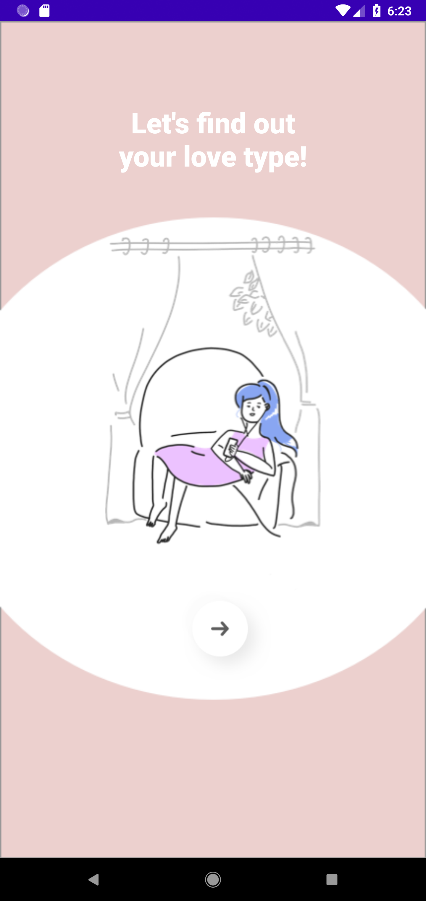
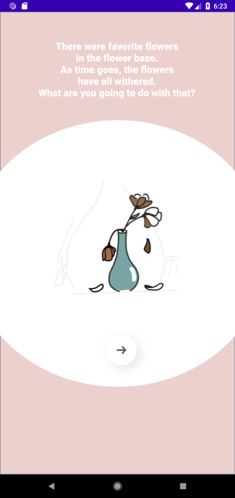
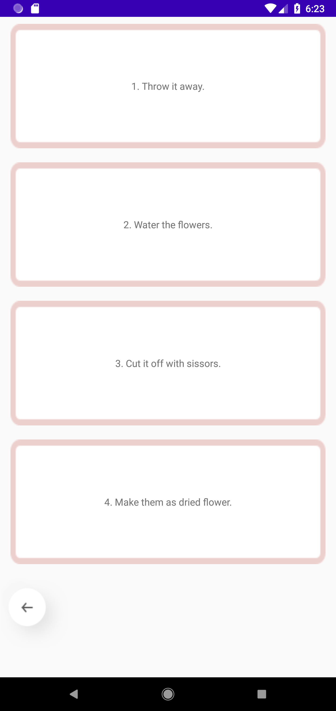
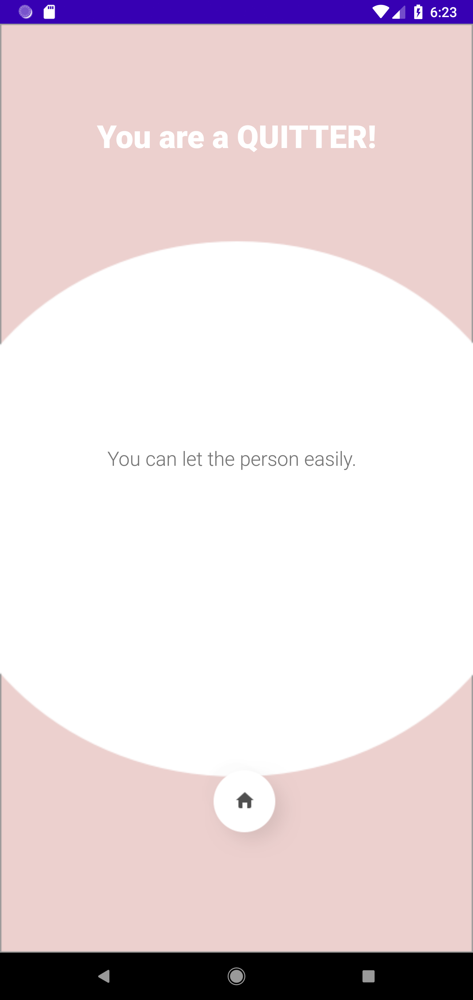
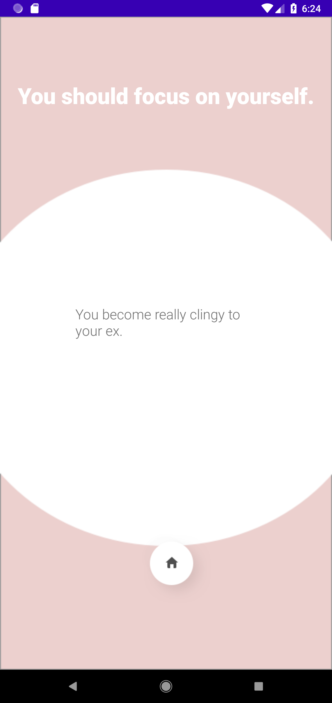
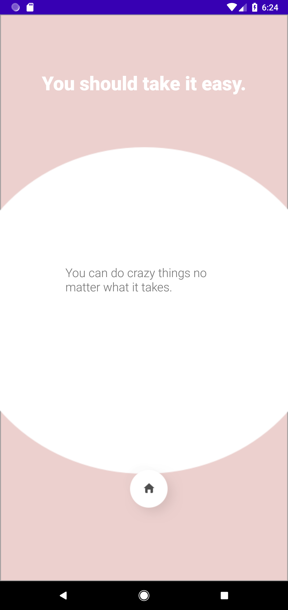

# LoveTest
이 앱은 [YouTube - 코틀린 3강으로 끝내기 - 3편 심리테스트 앱 만들기](https://www.youtube.com/watch?v=M1e2tLnzVPo) 영상을 보며 따라한 결과물입니다.
- JetPack의 Navigation을 사용한 간단한 심리테스트 앱입니다.
- 사용자의 선택에 따라 결과 화면의 텍스트가 변경됩니다.

## :camera: Screenshots
  

  

## :art: Project Structure
```
📁 app/src/main/java/com/jionchu/lovetest
 ├ 📁 fragment : 프래그먼트 폴더
 │  ├ 📄 MainFragment.kt : 테스트 시작 화면
 │  ├ 📄 QuestionFragment.kt : 문제 설명 화면
 │  ├ 📄 ResultFragment.kt : 테스트 결과 화면
 │  └ 📄 SelectionFragment.kt : 보기 선택 화면
 └ 📄 MainActivity.kt : 테스트가 진행되는 Navigation Host 화면
```

## :hammer: Development Environment
- Kotlin
- Android Studio @4.0.1

## :bookmark: Application Version
- minSdkVersion : 23
- targetSdkVersion : 29

## :books: Libraries Used
- [Navigation](https://developer.android.com/guide/navigation) : Jetpack Navigation 라이브러리
